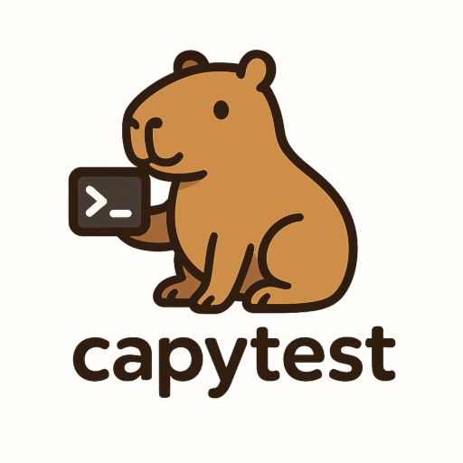

# capytest



**capytest** is a simple, friendly library for E2E testing CLI applications in Go.
It lets you write clear, step-by-step scenarios for both interactive and non-interactive command-line programs: send input, check output, verify exit codes, and simulate interrupts.

## Features

- Simple step-by-step scenarios
- Supports interactive and non-interactive CLIs
- Simulate interrupts and signals
- Check stdout, stderr, exit codes
- Pluggable providers (local, Podman or your own)

## Installation

```bash
# Install the core
go get -u go.alt-gnome.ru/capytest

# Install the necessary provider(s)
go get -u go.alt-gnome.ru/capytest/providers/local
```

## Example

```go
package main

import (
	"testing"

	"go.alt-gnome.ru/capytest"
	"go.alt-gnome.ru/capytest/providers/local"
)

func TestExample(t *testing.T) {
	ts := capytest.NewTestSuite(t, local.Provider())

	// Interactive scenario
	ts.Run("bc is works", func(t *testing.T, r capytest.Runner) {
		r.Command("bc").
			Do().SendLine("2+2").ExpectStdoutContains("4").
            Then().SendLine("2*3").ExpectStdoutContains("6").
			Then().Interrupt().
			Done().ExpectExitCode(-1).
			Run(t)
	})

	// Non-interactive scenario
	ts.Run("bash --version contains GNU", func(t *testing.T, r capytest.Runner) {
		r.Command("bash", "--version").
			ExpectStdoutContains("GNU").
			Run(t)
	})
}
```

## License

MIT License © 2025 Maxim Slipenko
